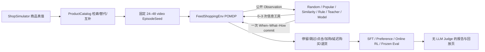

# 长程短视频 Feed 购物 Agent

这个 profile 把 ShopSimulator 的商品真值与本仓库的后训练工程组合成一个独立的
Feed POMDP。原有 ShopSimulator v2.1 / Reward v3 / Observation v2 / Tools v2
保持冻结；新代码全部位于 `shopping_grpo.feed`，使用自己的四个版本号：

```text
feed-environment-v1
feed-observation-v1
feed-tools-v1
feed-reward-v1
```

它解决的不是“搜索并买到一个商品”，而是：用户连续浏览固定短视频 Feed，Agent
在每条视频上决定何时介入、推荐什么、怎样呈现，并为之后才发生的购买和退货负责。

## 一条命令跑通 CPU MVP

以下命令不会加载模型、启动 Ray/CUDA、执行 SFT/GRPO 或调用 LLM Judge：

```bash
PYTHONPATH=src:. python3 scripts/run_feed_mvp.py \
  --output-dir outputs/feed-mvp \
  --episodes 30 \
  --feed-length 24 \
  --seed 42
```

输出包括五类数据、冻结 test split 评测报告和自包含 HTML 回放页：

```text
outputs/feed-mvp/
  seeds/{train,validation,test}.jsonl
  mixed_policy_logs/{train,validation,test}.jsonl
  sft_trajectories/
    train.jsonl
    train.A_action_contract.jsonl
    train.B_short_window.jsonl
    train.C_long_horizon.jsonl
    ...
  preference_pairs/{train,validation,test}.jsonl
  online_rl_tasks/{train,validation,test}.jsonl
  evaluation/{report.json,report.md,dashboard.html}
  manifest.json
  workflow_manifest.json
```

任何时候都可以重开全部清单并重新计算哈希：

```bash
PYTHONPATH=src:. python3 scripts/verify_feed_artifacts.py outputs/feed-mvp
```

仓库已经放入一个由完整 23,421 条商品目录生成的 3-episode × 24-video
可执行样例。它只用于检查链路，不是有统计意义的模型 Benchmark：

- [`examples/feed_mvp/manifest.json`](../examples/feed_mvp/manifest.json)
- [`examples/feed_mvp/evaluation/report.md`](../examples/feed_mvp/evaluation/report.md)
- [`examples/feed_mvp/evaluation/dashboard.html`](../examples/feed_mvp/evaluation/dashboard.html)

## 架构与信息边界



策略能看到：

- 公共 Persona：用户 ID、初始预算、声明的品类和风格偏好；
- 当前视频：caption、scene、objects、style、topics、ASR/OCR、creator、时长；
- 最近公开行为、购物车、已购商品；
- 信息工具返回的商品、评论、价格、库存和 evidence IDs；
- 当前 Feed 位置与本视频剩余工具次数。

策略永远看不到：

- 短期兴趣数值、真实购买意图、信任、疲劳、剩余预算和价格敏感度；
- 点击/购买/退货概率；
- 视频的 `related_product_ids`、embedding、候选角色或 seed metadata；
- Reward、hard/soft match、qualified 或 hindsight 标签。

Observation renderer 采用递归 fail-closed allowlist。出现未知顶层字段或
`latent/probability/reward/hindsight/...` 敏感键时直接拒绝，不会静默丢弃后继续训练。
混合策略日志中的 `evaluator_summary` 是唯一显式的离线真值区；它不会进入 SFT
messages、偏好 prompt 或 RL prompt。

## When–What–How 动作与工具

每条视频只允许一次扁平 commit：

```json
{
  "decision": "recommend",
  "surface": "review_summary",
  "product_ids": ["P001"],
  "relationship": "primary",
  "strategy": "review_summary",
  "evidence_ids": [
    "video.V103.object.storage_box",
    "product.P001.price",
    "product.P001.reviews"
  ],
  "explanation": "当前收纳场景匹配该商品，并明确披露评论风险。"
}
```

- When：`recommend | delay | no_recommend`；
- What：主商品、替代品、互补品或 bundle，最多两个商品；
- How：商品卡、优惠券、评论摘要、价格对比、相似商品、bundle 或 creator video。

七个信息工具与最终动作严格分离：

```text
retrieve_products       inspect_product
compare_products        read_reviews
find_alternatives       find_complements
check_inventory         commit_recommendation
```

每条视频最多三个信息调用。Action Guard 只读取环境提供的机器状态；它拒绝 schema
额外字段、不可见商品、不可见证据、无商品/上下文双重证据的推荐、购买后重复营销和
并行工具调用。两个商品必须使用 bundle relationship；bundle surface/strategy 也必须
恰好引用两个商品，而且每个商品都要出现在点分隔的公开 evidence ID 中。购买不会结束 Feed。

## 数值混合用户模拟器

`FeedShoppingEnv` 用私有潜变量维护短期兴趣、意图、信任、疲劳、剩余预算与价格
敏感度。点击、加购、购买和退货通过可校准的 logistic/conditional 概率生成；LLM
不参与用户行为或 Reward 判断。

关键时间语义：

- 当前行为会改变后续兴趣、意图、信任与疲劳；
- 购买在之后 1–2 个 step 才结算，原推荐 step 保存在 `source_step`；
- Feed 继续播放，终局再结算保留或退货；
- session break 降低疲劳，但保留兴趣、购物车和购买历史；
- 所有随机量按 `(episode, step, channel, entity)` 寻址，分支不会挪动其他随机流。

因此事实轨迹与 `do(a_t=no_recommend)` 反事实轨迹可以共享 Common Random Numbers，
内容停留/点赞噪声保持一致，只比较该次商业介入带来的增量长期价值。

## 用真实长程日志校准

校准数据只需提供事件 JSONL，或 aggregate JSON：

```json
{
  "impression": 100000,
  "watch": {"count": 58000, "total_dwell_seconds": 812000},
  "skip": 42000,
  "like": 4300,
  "click": 5100,
  "cart": 730,
  "purchase": {"count": 205, "total_value": 18350},
  "return": 17
}
```

生成带来源 SHA-256 的校准文件：

```bash
PYTHONPATH=src:. python3 scripts/calibrate_feed_simulator.py \
  data/feed-events.json \
  outputs/feed-calibration.json \
  --smoothing 10
```

再让完整链使用该分布：

```bash
PYTHONPATH=src:. python3 scripts/run_feed_mvp.py \
  --output-dir outputs/feed-calibrated \
  --episodes 30 --feed-length 24 --seed 42 \
  --calibration outputs/feed-calibration.json
```

KuaiRand/KuaiRec 一类日志在这里拟合行为分布，不会被伪装成与 ShopSimulator
商品 ID 对齐的事实记录。校准值会写入数据 manifest 和在线 RL task，但不会进入
模型可见 Observation。

## 五类数据与课程 SFT

1. `seeds`：Persona、固定 Feed、候选商品池、库存、session break 与 CRN seed；
2. `mixed_policy_logs`：Random、Popular、Similarity、Rule、Teacher 的完整轨迹；
3. `sft_trajectories`：OpenAI tool-calling messages 与 8 个 frozen schemas；
4. `preference_pairs`：同状态、同噪声、替换一个动作的 chosen/rejected 对；
5. `online_rl_tasks`：EpisodeSeed、候选商品真值和公共初始 prompt 的 veRL task。

train/validation/test 同时按 `episode_id` 和 `persona_id` 隔离。每个视频的 evaluator
候选都含强相关、hard negative、低价替代、互补和完全无关角色，但这些标签不进入
策略观测。

SFT 为每个 Teacher episode 派生三个可直接消费的文件：

- `A_action_contract`：单视频，先学习协议与合法动作；
- `B_short_window`：最多 8 个视频的前缀，学习局部历史与候选比较；
- `C_long_horizon`：一行就是完整 24–48 视频 episode，学习延迟转化和跨视频记忆。

所有 SFT 行的 `messages` 采用与 JSONL 相同的规范化序列化方式计数，最多
240,000 字符。C 阶段不会拆开或跨 JSONL 行续接状态；若完整 episode 超出预算，数据
生成会显式失败，不会静默截断。每条轨迹仅在首步保留完整 user observation 检查点，后续
步骤由 `feed-tool-delta-v1` 的 commit `state_delta.current_video` 和公开事件推进；未在
delta 中出现的公开字段沿用前文。信息工具与偏好 prompt 也使用同一 delta 协议，且
不会重复嵌入 persona、recent events 或完整 post-observation。生产 Feed 长度严格限定
为 24–48；更短序列只允许出现在单元测试的直接 simulator fixture 中。

内置 Teacher 只读公开 observation/tool result，并确定性覆盖互补 bundle、低价替代、
评论披露、优惠、延迟和正确抑制等动作族。偏好对的反事实轨迹会重放已记录的后续动作
并按当前公开证据重建调用；不会在替换目标 action 后重新采样一套 Teacher 决策。

现有 `training/sft/dataset.py` 继续使用目标模型的 chat template，只对 assistant
自然语言和 tool-call token 计算 loss；system/user/tool observation 全部 mask。示例：

```bash
PYTHONPATH=src:. python3 scripts/train_lora_sft.py \
  --model Qwen/Qwen3.5-2B \
  --train outputs/feed-mvp/sft_trajectories/train.A_action_contract.jsonl \
  --validation outputs/feed-mvp/sft_trajectories/validation.A_action_contract.jsonl \
  --output outputs/models/feed-sft-a \
  --max-length 65536 --reject-dropped-samples \
  --gradient-checkpointing --attention-implementation sdpa
```

按 A → B → C 依次训练；每阶段先按现有 SFT 文档合并上一阶段 LoRA，再把合并模型作为
下一阶段 `--model`。240,000 字符只是生成期的整轨迹上限，不等于目标模型 token 数；
`--reject-dropped-samples` 会用真实 tokenizer/chat template 做最终闸门，任何超长或模板
不一致都在加载模型权重前终止。这里没有自动启动训练。

`preference_pairs` 的 chosen/rejected 使用相同中性 call ID，收益来自对序列化替代动作
本身的 CRN 重放，不携带标签泄漏。先转换并验证为 conversational DPO 契约：

```bash
PYTHONPATH=src:. python3 scripts/prepare_feed_dpo_data.py \
  outputs/feed-mvp/preference_pairs outputs/feed-mvp/dpo --inspect-only
```

去掉 `--inspect-only` 会写 train/validation JSONL 与哈希清单；test 只用于隔离检查。
DPO 是可选阶段，不替代在线环境优化，本工作流不会自动启动 DPO 训练。

## veRL 0.8 与信用分配

先验证静态配置；该命令不导入模型或启动 Ray：

```bash
PYTHONPATH=src:. python3 scripts/check_feed_grpo_runtime.py
```

把在线 task 转为 veRL Parquet。CPU 环境可以先只检查；真正写 Parquet 需要 GRPO
环境中的 `pyarrow`：

```bash
PYTHONPATH=src:. python3 scripts/prepare_feed_grpo_data.py \
  outputs/feed-mvp/online_rl_tasks \
  outputs/feed-mvp/grpo_parquet \
  --inspect-only

# 在已安装 GRPO extras 的训练节点去掉 --inspect-only
```

Feed 专用启动器会设置正确的 config、catalog、task 与 256-turn/64K context 契约。
在线工具回复使用 `feed-tool-delta-v1`，不会在每次 commit 后重复 persona、累计历史和
完整 observation；48-video 最短轨迹有线性长度回归测试。模型 `config.json` 若声明的
context 小于 65,536，启动器会拒绝。

先使用 `--dry-run`：

```bash
PYTHONPATH=src:. python3 scripts/train_feed_grpo.py \
  --model outputs/models/feed-sft-c-merged \
  --train-data outputs/feed-mvp/grpo_parquet/train.parquet \
  --val-data outputs/feed-mvp/grpo_parquet/validation.parquet \
  --dataset-dir outputs/feed-mvp \
  --output outputs/models/feed-grpo \
  --credit-mode terminal \
  --dry-run
```

真正执行（不带 `--dry-run`）前还会打开传入的 train/validation Parquet，验证 schema、
24–48 视频、seed/catalog、初始 observation、episode/persona 三分割隔离，并核对 Parquet
清单、五类数据清单和冻结 test 源哈希；`feed_task`/`catalog` 等运行时覆盖列会被拒绝。
同时检查实际
`--config`、两个 veRL patch marker 和 8 个工具 schema 的 validation/model-dump
roundtrip。Hydra 只能覆盖学习率、temperature、训练步数等调参，不能改写这些已审计
边界。

仓库固定的 veRL 0.8 patch 同时修改 `ray_trainer.py` 和 `tools/schemas.py`。后者显式
保留递归 `items`、长度/数量、唯一性与 `additionalProperties` 约束，避免 veRL 在
下发工具前静默丢掉严格 schema。应用脚本对两个官方源文件分别锁定 SHA-256，并以
双文件事务执行 apply/restore。

当前能力边界必须明确：

| credit mode | 已计算 | veRL extra_fields/commit token 映射 | vanilla veRL 0.8 真正用于 advantage |
|---|---:|---:|---:|
| terminal | 是 | 是 | 是，终局 scalar |
| RTG | 是 | 是 | 否 |
| event source credit | 是 | 是 | 否 |
| CRN counterfactual `A_cf` | 是 | 是 | 否 |

`FeedToolAgentLoop` 会把四种向量、事件归因和 assistant commit position 写入审计
metadata，但 vanilla veRL 0.8 仍把 `reward_score` 的终局标量放到序列奖励。选择非
terminal mode 时，启动器要求显式 `--acknowledge-metadata-only`，防止误以为过程
advantage 已接入 trainer。真正做 RTG/event/counterfactual GRPO 对比还需要一个经过
版本锁定和训练回归验证的 veRL advantage patch；本仓库没有伪造这一结果。

延迟 purchase event 内部记录其 qualified-value 与 satisfaction 分量；event-source
credit 会把两者一起回迁到原推荐 step，同时保留 realization step 自己产生的体验奖励。

## Reward 与冻结评测

Reward 分开记录：qualified purchase value、满意度、正确不推荐、bundle value、
dwell/click/cart 小权重 shaping，以及 interruption、无关推荐、重复曝光、优惠成本、
退货和 unsupported claim 惩罚。点击或停留不能压过商品硬约束与退货结果。

冻结评测要求所有策略使用相同 test episode 集，不配对就拒绝生成报告：

当传入 `--dataset-dir` 时，基线日志必须匹配 manifest 声明的
`mixed_policy_logs/test.jsonl`。模型日志可以位于别处，但必须先用 checkpoint、日志、
dataset manifest 和 frozen seed 哈希生成 sealed run manifest；两种路径都会逐行核对
episode ID 与 persona ID。仅把训练日志中的 `split` 改成 `test` 不能生成冻结报告。

```bash
PYTHONPATH=src:. python3 scripts/evaluate_feed.py \
  outputs/feed-mvp/mixed_policy_logs/test.jsonl \
  outputs/feed-mvp/evaluation \
  --dataset-dir outputs/feed-mvp

# 对已启动的 OpenAI-compatible 本地/受控模型服务执行 frozen rollout；
# 请求中只有公开 observation、工具 schema 和 delta，不发送 seed/catalog 真值：
PYTHONPATH=src:. python3 scripts/rollout_feed_model.py \
  outputs/feed-mvp outputs/eval/feed-grpo-test.jsonl \
  --base-url http://127.0.0.1:8000/v1 \
  --model feed-grpo --policy-id feed-grpo

# 再把日志与实际 checkpoint、frozen seeds 和 dataset manifest 一起密封：
PYTHONPATH=src:. python3 scripts/seal_feed_frozen_run.py \
  outputs/eval/feed-grpo-test.jsonl outputs/feed-mvp \
  outputs/models/feed-grpo/model.safetensors \
  outputs/eval/feed-grpo-test.run.json --policy-id feed-grpo

PYTHONPATH=src:. python3 scripts/evaluate_feed.py \
  outputs/eval/feed-grpo-test.jsonl outputs/eval/feed-grpo-report \
  --dataset-dir outputs/feed-mvp \
  --run-manifest outputs/eval/feed-grpo-test.run.json

PYTHONPATH=src:. python3 scripts/build_feed_demo.py \
  outputs/feed-mvp/mixed_policy_logs/test.jsonl \
  outputs/feed-mvp/evaluation/dashboard.html \
  --summary outputs/feed-mvp/evaluation/report.json
```

报告不合并成一个“万能分数”，而是同时给出：

- 合格购买、CTR、加购、购买、退货、净收益；
- 正确不推荐、每百视频介入、无关推荐、重复曝光、中断率；
- watch/skip/like、平均停留、终局满意度与疲劳；
- evidence grounding、unsupported claim、bundle precision、工具调用；
- 长期累计回报。

HTML 使用“因果胶片”回放每个 Feed step，并标出 `source_step → realized_step`。页面
没有 CDN 或网络依赖，旁边的 demo manifest 记录输入和 HTML 哈希。

## 已知限制

- v1 使用结构化视频标签和可选预计算 embedding，不包含端到端视频编码器；
- 示例 Persona 与 Feed 是确定性合成数据，正式结论必须使用真实日志校准并做
  simulator-shift 验证；
- evidence guard 保证引用存在和商品/上下文双重 grounding，但不等同于 NLI 级
  自然语言蕴含验证；
- 仓库内示例报告只有一个 test episode，用于 smoke，不代表策略优劣；
- 非 terminal 过程信用尚未接入 veRL trainer advantage，见上表。

所有数据、评测、demo 与工作流 manifest 都可用 SHA-256 重开验证。任何 SFT、GRPO、
模型合并或正式大规模评测都必须由用户显式启动。
